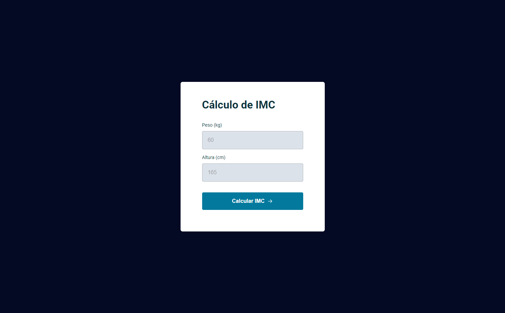

<h1 align="center"> Calculadora de IMC </h1>

Projeto desenvolvido no curso Explorer da Rocketseat. 

  <a href="#-tecnologias">Tecnologias</a>&nbsp;&nbsp;&nbsp;|&nbsp;&nbsp;&nbsp;
  <a href="#-projeto">Projeto</a>&nbsp;&nbsp;&nbsp;|&nbsp;&nbsp;&nbsp;

 

  

## 🚀 Tecnologias

Esse projeto foi desenvolvido com as seguintes tecnologias:

- HTML e CSS
- JavaScript
- Git e Github
- Figma

## 💻 Projeto

O cálculo IMC (Índice de Massa Corporal) é um app para medir se alguém está ou não com o peso ideal.

- [Acesse o projeto finalizado, online](https://calculadora-de-imc-neon.vercel.app/)
